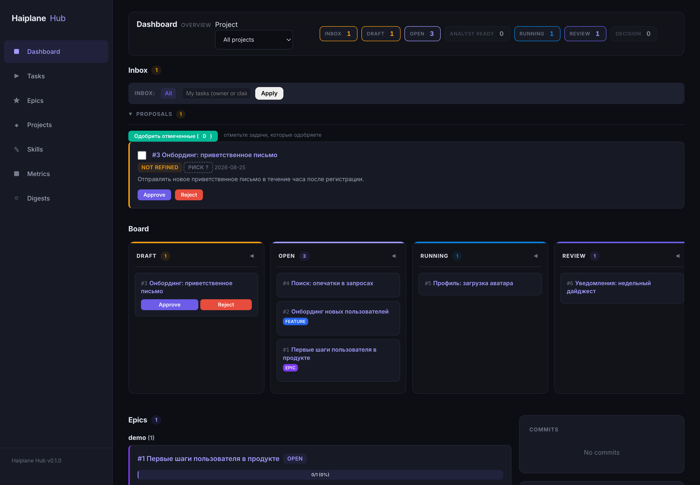
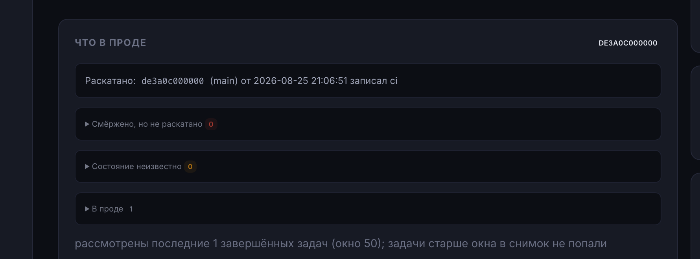
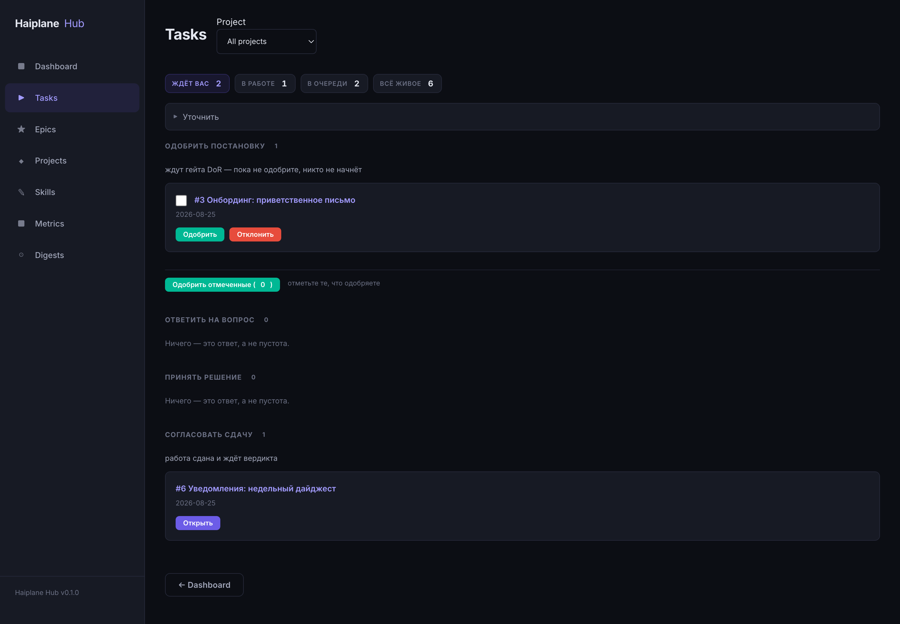
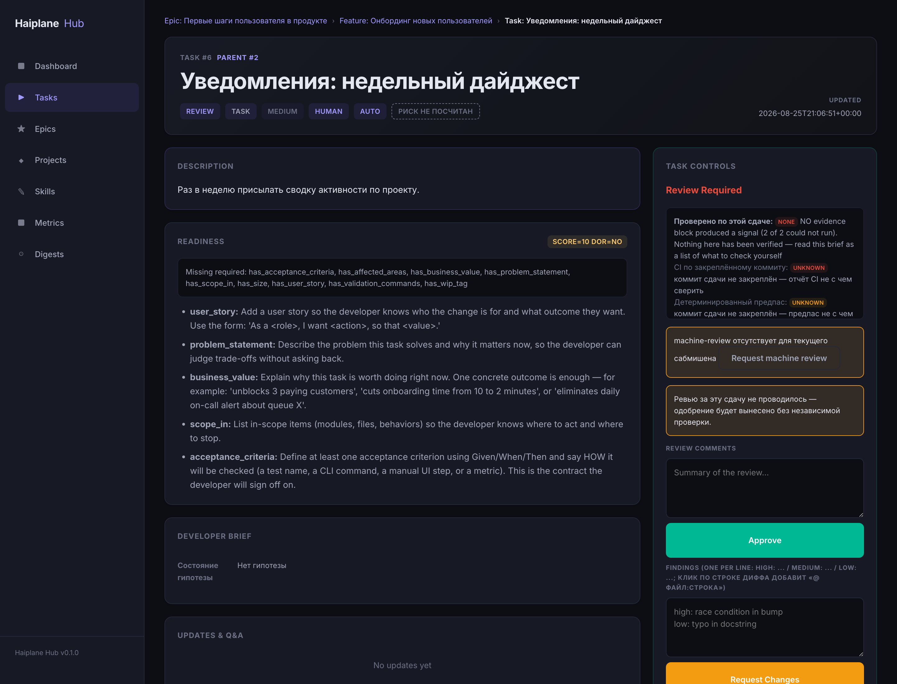

# Haiplane Hub

Оркестратор задач для разработки с AI-агентами — с теми гейтами, которые
человеку действительно нужны: задача не готова к работе, пока не записаны её
критерии приёмки, и не считается сделанной, пока хаб не может назвать коммит,
который её везёт.



*(English summary: [README.en.md](README.en.md).)*

## Заявлено ≠ доставлено

«Готово» от агента — это заявление, а не факт. Работа за ним может лежать в
ветке, которую никто не смержил, в PR, у которого CI так и не позеленел, или в
мерже, который ещё не увезён релизом в прод. В трекере, где последняя колонка
называется Done, все три случая выглядят одинаково — и каждый из них уже стоил
кому-то утра, потраченного на чтение логов CI.

Haiplane Hub держит заявление и факт порознь и показывает разрыв между ними:

- задача не выйдет из `draft`, пока не пройден Definition of Ready — критерии
  приёмки в форме Given/When/Then, способ проверки, заявленный объём;
- задача не дойдёт до `completed` без актуального вердикта ревью, и агент,
  который её делал, не может быть тем, кто её одобряет;
- у задачи в статусе `completed` остаётся ещё один вопрос — *доехала ли работа
  до прода?* — и он отвечается по записанным фактам: мержу, который сделал сам
  хаб, и выкату, о котором отчитался CI. Когда ответа нет, хаб так и говорит и
  никогда не выдаёт незнание за отрицание.



## Возможности

- **DoR-гейт с исполняемыми критериями приёмки** — Given/When/Then, которые
  могут называть тест, доказывающий их, детерминированная оценка готовности и
  approve, который отказывает драфту, не покрытому критериями.
- **Гейт ревью** — никакого `completed` без актуального вердикта APPROVED;
  вердикт от агента-исполнителя по умолчанию запрещён, а если разрешён — он
  помечается и аудируется.
- **Учёт доставки до SHA** — смержено, увезено релизом, раскатано или
  неизвестно, и всегда с причиной.
- **MCP-сервер для агентов** — та же работа с задачами по Model Context
  Protocol: Cursor, Claude Code и любой клиент со streamable HTTP.
- **Web-дашборд** — доска на HTMX, инбокс, карточка задачи, просмотр логов; без
  этапа сборки фронтенда.
- **CLI** — `hp-hub` для людей и скриптов.
- **Иерархия и жизненный цикл** — Epic → Feature → Task → Subtask и путь
  draft → open → running → review → completed с CI-проверками, вопросами и
  человеческими решениями по дороге.



## Быстрый старт

### Docker (быстрее всего)

```bash
git clone https://github.com/agentdrover/haiplane.git
cd haiplane
docker compose up -d --build
# → http://localhost:8080
```

Контейнер поднимается с демо-данными (проект `demo`: эпик, фича и задачи по
всему жизненному циклу, одна из них — доставленная в прод), поэтому дашборд
живой с первого открытия. Чтобы стартовать с пустым хабом, поставьте
`HAIPLANE_DEMO_SEED: "0"` в `docker-compose.yml`. База SQLite сохраняется в
`./data` на хосте.

### Из исходников

Нужны Python 3.11+ и [uv](https://docs.astral.sh/uv/).

```bash
git clone https://github.com/agentdrover/haiplane.git
cd haiplane

# Установка (заодно взводит pre-push хук с политикой веток)
make setup

# Запуск
haiplane-hub
# → http://localhost:8080
```



## Подключить агента (MCP)

MCP-сервер живёт в том же процессе, что и веб-интерфейс. Endpoint — `/mcp`,
транспорт streamable HTTP, авторизация Bearer-токеном из
`HAIPLANE_HUB_TOKENS`:

```jsonc
// ~/.cursor/mcp.json — или любой MCP-клиент со streamable HTTP
{
  "mcpServers": {
    "haiplane-hub": {
      "type": "streamable-http",
      "url": "http://127.0.0.1:8080/mcp",
      "headers": { "Authorization": "Bearer <TOKEN>" }
    }
  }
}
```

Для локального агента есть и stdio-транспорт — `haiplane-hub-mcp`, который
проксирует вызовы в REST API хаба по `HAIPLANE_HUB_URL` с токеном из
`HAIPLANE_HUB_TOKEN`.

Полная настройка, проверка через curl и таблица типовых ошибок (401, 406, 421,
missing session) — в
[docs/agent-mcp-operator-guide.md](docs/agent-mcp-operator-guide.md).

Инструменты, которых агенту хватает на каждый день:

- `hub_my_context`, `hub_project_status`, `hub_list_tasks`, `hub_task_status`
- `hub_refine_task`, `hub_get_readiness`, `hub_add_acceptance_criterion`,
  `hub_replace_acceptance_criteria`, `hub_add_risk`
- `hub_claim_task`, `hub_pair_start`, `hub_task_update`, `hub_ask_question`
- `hub_submit_for_review`, `hub_submit_review`, `hub_report_done`

Человеческие гейты (`hub_approve_task`, `hub_reject_task`, `hub_start_task`,
`hub_decide_task`, `hub_force_complete_task`) требуют человеческого токена —
агент не может провести себя через них сам, в этом и смысл.

## Конфигурация

Всё настраивается переменными окружения с префиксом `HAIPLANE_*`. Значения по
умолчанию ниже — те же, что в `hub/config.py`; этот файл и есть источник истины,
в нём же полный список.

| Переменная | По умолчанию | Описание |
|---|---|---|
| `HAIPLANE_HUB_HOST` | `127.0.0.1` | Адрес прослушивания. Бинд не на loopback без настроенных токенов запрещён на старте |
| `HAIPLANE_HUB_PORT` | `8080` | Порт |
| `HAIPLANE_HUB_DB` | `~/.local/state/haiplane-hub/hub.db` | Путь к базе SQLite |
| `HAIPLANE_HUB_TOKENS` | `""` | `name:token[:role]` через запятую; роли `human`, `agent`, `admin`. Пусто — однопользовательский открытый режим |
| `HAIPLANE_HUB_ALLOW_UNAUTHENTICATED_NETWORK` | `0` | `1` разрешает сетевой бинд без токенов (так делает docker-демо; на общем хосте небезопасно) |
| `HAIPLANE_DEMO_SEED` | `0` | `1` засевает проект `demo` в пустую базу. Идемпотентно |
| `HAIPLANE_HUB_REPO` | `""` | GitHub-репозиторий (`owner/repo`) для интеграции с PR и коммитами |
| `HAIPLANE_WORKSPACE_REPO` | `~/.haiplane/workspace/repo` | Путь к рабочей копии git |
| `HAIPLANE_PAIR_BASE_BRANCH` | `develop` | Ветка, от которой отходят и в которую вливаются ветки задач |
| `HAIPLANE_RELEASE_BRANCH` | `main` | Ветка, в которую релиз увозит базовую |
| `HAIPLANE_REVIEW_SELF_APPROVE` | `forbid` | `allow` разрешает агенту-исполнителю самому выносить вердикт (solo-режим); такие вердикты помечаются `self_approved`, логируются и бейджатся |
| `HAIPLANE_MACHINE_REVIEW` | `warn` | `require` блокирует человеческий вердикт, пока нет актуального отчёта машинного ревью |
| `HAIPLANE_SDD_AC_LOCATOR` | `off` | `require` отклоняет AC с `verifiable_by=test` без разрешимого pytest-локатора |
| `HAIPLANE_SDD_AC_TESTS` | `warn` | `require` блокирует вердикт APPROVED, пока хоть один AC-тест красный или отсутствует |
| `HAIPLANE_SDD_VALIDATION` | `warn` | `require` блокирует завершение, пока текущий прогон validation не зелёный |
| `HAIPLANE_MAX_REVIEW_CYCLES` | `3` | Максимум автоматических циклов ревью на задачу |
| `HAIPLANE_STALE_MINUTES` | `30` | Минуты, после которых running-задача помечается зависшей |
| `HAIPLANE_DISPATCH_BIN` | `~/.local/bin/hp-dev-dispatch` | Необязательный диспетчер агентов-разработчиков. Его отсутствие — норма: гейты работают и без него |
| `GH_BIN` | `gh` | Бинарь GitHub CLI |

## Статус и поддержка

Проект ведёт один человек. Поддержка — по мере сил: issues и вопросы читаются,
ответ может занять время, SLA нет. PR приветствуются — см.
[CONTRIBUTING.md](CONTRIBUTING.md).

Лицензия MIT.

## Документация

- [Процесс разработки](docs/software-development-workflow.md) — поток
  «человек + агент», который хаб и реализует.
- [Структурная форма задачи и готовность](docs/task-form-and-readiness.md) —
  профили DoR по типам работ, оценка готовности, CLI и MCP.
- [Руководство оператора MCP](docs/agent-mcp-operator-guide.md) — транспорты,
  заголовки, проверки curl, разбор ошибок.
- [Онбординг агента](docs/agent-onboarding.md) и
  [правила для Cursor](docs/cursor-agent-rules.md) — что агент должен знать до
  того, как возьмёт задачу.
- [Архитектура и плагины](docs/architecture.md) — карта модулей, протоколы
  плагинов, использование хаба как сабмодуля.
- [Правила репозитория](docs/repository-rules.md) — ветки, коммиты, ревью.
- [Политика безопасности рабочих копий](docs/workspace-safety-policy.md) —
  инварианты, которые не дают параллельным агентам лезть в чужие чекауты.
