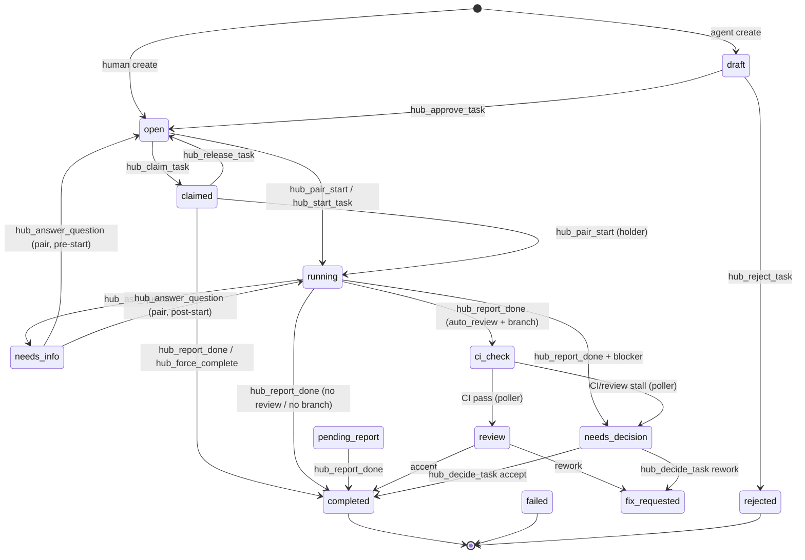

# Онбординг агента: как работать с OpenClaw Hub

Эта инструкция — единая точка входа для нового ИИ-агента (Cursor или удалённого),
который начинает работать с сервисом OpenClaw Hub. Прочитай её целиком до первого
действия. Hub — это **источник правды** по состоянию задач, вопросам, блокерам,
решениям и отчётам о завершении.

> Если что-то в этом файле расходится с `docs/cursor-agent-rules.md`,
> `docs/repository-rules.md` или `AGENTS.md` — приоритет у этих документов,
> а здесь сообщи о расхождении.

---

## 1. Что такое Hub

Сервер оркестрации задач для агентской разработки. Один домен — четыре поверхности:

| Поверхность | Точка входа | Назначение |
|---|---|---|
| REST API | `hub/app.py` | канонический read/write API |
| Web UI | `hub/web.py` + `hub/templates/` | HTMX-дашборд, inbox, детали задач |
| CLI | `hub/cli.py` (`oc-hub`) | командная строка оператора/агента |
| **MCP** | `hub/mcp_server.py` | инструменты для модели (Cursor и удалённые агенты) |

Важно: **MCP — это проекция REST API**, не отдельная бизнес-логика. Любое
изменение контракта затрагивает REST + CLI + MCP + тесты в одном проходе.

Иерархия задач: `epic → feature → task → subtask`.
Жизненный цикл: `draft → open → running/claimed → pending_report → ci_check/review/fix_requested → completed`
(плюс `needs_info`, `needs_decision`, `failed`, `rejected`).

### Машина состояний (task/subtask)



**Иерархия:** `epic → feature → task → subtask`. В `hub_create_task` / `hub_create_subtasks`
указывай `parent_id` и `task_type`; epic/feature создаются как `open` и не auto-run.

**Роллап:** при завершении последней дочерней `task` feature переходит в `completed`;
когда все features эпика завершены — epic тоже `completed` (идемпотентно).

**Pair branch:** дефолт `task-<id>/<slug-from-title>` (без суффикса `test`).

---

## 2. Два инстанса — не перепутай

| Инстанс | URL | Назначение |
|---|---|---|
| **Локальный** | `http://127.0.0.1:8080` | разработка, своя `hub.db` |
| **Production** | `http://agenthai.ru:8080` (IP `194.113.34.33`) | боевой сервер |

Ключевые факты:

- У инстансов **разные базы данных**. Завершил задачу локально — на проде она
  всё ещё может быть `open`/`draft`, пока статус не синхронизирован.
- **Деплой кода** идёт только при merge в `main` (CD в `.github/workflows/ci.yml`).
  Merge в `develop` — НЕ прод.
- Порт `8080` снаружи закрыт. К production MCP подключайся через SSH-туннель:

  ```bash
  ssh -L 8080:127.0.0.1:8080 user1@194.113.34.33
  # затем MCP URL: http://127.0.0.1:8080/mcp
  ```

- Токен для Cursor лежит на сервере: `~/openclaw-hub-cursor-token.txt`
  (только наличие проверяй, **в чат токены не печатай**).
- Каждый ответ MCP-инструмента содержит поля **`instance`** (`prod`|`local`) и
  **`base_url`** (значение `OPENCLAW_HUB_URL` на сервере). Для JSON-ответов парси
  `json.loads(result)`; для mutation-envelope поля рядом с `status`/`awaiting`.

---

## 3. Подключение MCP

MCP смонтирован на `/mcp` (streamable HTTP). Аутентификация — Bearer-токен.

Минимальная проверка, что сервер жив:

```bash
# initialize → ожидаем serverInfo: openclaw-hub
curl -sS \
  -H "Authorization: Bearer <TOKEN>" \
  -H "Accept: application/json, text/event-stream" \
  -H "Content-Type: application/json" \
  -d '{"jsonrpc":"2.0","id":1,"method":"initialize","params":{"protocolVersion":"2024-11-05","capabilities":{},"clientInfo":{"name":"probe","version":"1.0"}}}' \
  http://127.0.0.1:8080/mcp
```

На что обращать внимание:

- На POST/GET к `/mcp` нужен заголовок `Accept: application/json, text/event-stream`.
  Без него часть клиентов получает 406. В hub есть middleware, который это
  чинит, но свой клиент лучше настроить корректно.
- После `initialize` сервер возвращает `Mcp-Session-Id` — передавай его в
  последующих запросах (`tools/list`, `tools/call`).
- Конфигурация окружения локального hub — в `.env.local`
  (`OPENCLAW_HUB_URL`, `OPENCLAW_HUB_TOKEN`, `OPENCLAW_HUB_DB`, `OPENCLAW_HUB_TOKENS`).

---

## 4. Обязательный рабочий цикл

(Полная версия — `docs/cursor-agent-rules.md`.)

1. **Контекст.** Перед стартом вызови `hub_my_context(task_id)` и прочитай ответ.
2. **Готовность.** Если задача не готова (Definition of Ready) — не пиши код.
   Дорабатывай через `hub_refine_task`, `hub_add_acceptance_criterion`,
   `hub_replace_acceptance_criteria`, `hub_add_risk`, затем `hub_get_readiness`.

   > **Скаляр vs list в `hub_refine_task`:** скалярные поля (`title`, `description`,
   > `technical_hints`, …) — PATCH: передай только то, что меняешь. Списки
   > `acceptance_criteria=[...]` и `risks=[...]` — **полная замена** списка при
   > передаче (включая `[]` для очистки). Для одного AC без замены всего списка
   > используй `hub_upsert_acceptance_criterion` или идемпотентный
   > `hub_add_acceptance_criterion` (повтор `ac_id` — no-op, не 409).

   > **Граница DoR: наличие ≠ качество.** `readiness`/DoR проверяет, что поля
   > и AC *заполнены*, а не что они осмысленны. `score=100` можно получить с
   > формально валидными, но пустыми по смыслу AC. `hub_get_readiness` теперь
   > возвращает мягкое (non-blocking, severity `low`) предупреждение по «тонким»
   > AC, но оно не влияет на score/`dor_passed`. Финальная оценка качества —
   > всё равно на ревьюере. Пиши содержательные Given/When/Then.
3. **План.** Зафиксируй план: `hub_start_task(..., plan="...")` или
   `hub_task_update(..., kind="status", content="Plan: ...")`.
4. **Вопросы — только через `hub_ask_question`.** Не полагайся на вопросы в чате.
5. **Блокеры — `hub_task_update(..., kind="blocker")`.** Если нужен ответ
   человека — `hub_ask_question`.
6. **Завершение — `hub_report_done`.** Укажи изменённые файлы, изменение
   поведения и команды валидации с результатами.
7. **Вне scope — только draft-предложение** через `hub_propose_task`.
   Не расширяй задачу молча.
8. **Не закрывай задачу** при падающем CI, неразрешённом блокере или запрошенных
   правках ревью. Используй `hub_decide_task` или человеческий гейт.

---

## 5. Два пути исполнения после approve

| Путь | Старт | Кто пишет код | `job_id` |
|---|---|---|---|
| **A — headless** | `hub_start_task` | `oc-dev-dispatch` на сервере | есть |
| **B — pair (Cursor)** | `hub_pair_start` | человек + агент в Cursor | нет |

Если ты — агент в Cursor рядом с человеком, это **почти всегда путь B**.
`hub_start_task` запускает headless dispatch — не вызывай его для pair-работы.

Подробности pair path B: `docs/task-workflow.html` и
`docs/software-development-workflow.md#pair-mode-git-policy`.

---

## 6. Git-политика (pair mode) — главные грабли

- **Чистый worktree перед `hub_pair_start`.** При грязном worktree pair-start
  вернёт 422, а git ops при создании ветки может выполнить `git clean -fd` —
  несохранённая работа потеряется. Сначала commit или stash.
- **Ветки задач:** `task-<hub-id>/<short-slug>` от `develop`, merge обратно в
  `develop`. Без задачи — `fix/<slug>` или `chore/<slug>`.
- **Одна задача — одна ветка.** Не смешивай несвязанные изменения.
- **Push явным именем ветки**, не `HEAD`.
- После pair-start сверь `tasks.branch` в hub с `git branch --show-current`.
- **Merge в `main` = релиз и автодеплой.** Сначала `develop`, в `main` —
  только проверенное. См. `deploy/CD.md` и `docs/agent-deploy-runbook.md`.

---

## 7. Человеческие гейты (human gates)

- **Approve:** `hub_approve_task`. `force=true` — только явный человеческий
  override, аудируется API.
- **Слабый/отсутствующий отчёт** в `pending_report` принимает только человек —
  `hub_force_complete_task`.
- **Решение после арбитража:** `hub_decide_task`.

Агент не имитирует человеческий гейт и не «дожимает» статус сам.

---

## 8. `hub_report_done`: реальный статус, не желаемый

`hub_report_done` возвращает **фактический** статус задачи после обработки
жизненного цикла, а не «должно быть completed»:

- `pending_report` → обычно `completed`;
- pair (`open`/`running` без `job_id`) → `completed` или `ci_check` (только при
  наличии `branch` и `auto_review`);
- из `open` без pair-start — **ошибка** `pair_start_required`, done-запись не
  создаётся;
- текст ответа всегда отражает реальный статус.

Не считай задачу завершённой только потому, что отправил отчёт.

---

## 9. StructuredContent (структурированные ответы MCP)

Часть инструментов возвращает не только текст, но и машиночитаемый
`structuredContent` (`schema_version: "1"`) — у них есть `outputSchema` в
`tools/list`. Сейчас это пилот на трёх инструментах:

| Tool | structuredContent | Текст |
|---|---|---|
| `hub_create_task` | `task` (полный REST-ответ) | «Task #N created …» |
| `hub_refine_task` | `task_id`, `fields_set`, `acceptance_criteria_count`, `risks_count`, `readiness_score`, `dor_passed`, `task` | какие поля применены + счётчики/readiness |
| `hub_refine_tasks` | `results[]` (по задаче: `fields_set`, счётчики, `readiness_score`, `dor_passed`) | «Refined N task(s) …» |
| `hub_task_status` | `task` (REST GET после refresh) | многострочный статус |

Для надёжной автоматизации проверяй `structuredContent`, а не парси текст.
Остальные инструменты пока возвращают только текст (это нормально).
Контракт — `hub/mcp_structured.py`.

---

## 10. Карта MCP-инструментов

**Контекст / чтение**
- `hub_project_status` — сводка по проекту
- `hub_list_tasks` — список с фильтрами (`status`, `task_type`, `parent_id`,
  `human_owner`, `claimed_by`, `mine`, `include_archived`)
- `hub_task_status` — детальный статус задачи *(structuredContent)*: описание,
  `technical_hints`, scope, `validation_commands`, acceptance-criteria и
  `lifecycle_hint` (ожидание ci_check и т.п.) — одним вызовом для ревью ТЗ
- `hub_task_tree` — дерево подзадач
- `hub_my_context` — контекст для старта работы
- `hub_get_readiness` — Definition of Ready / рекомендации (одна задача)
- `hub_readiness_tree` — DoR по всему поддереву epic/feature за один вызов:
  какие задачи не проходят DoR и почему (`not_ready`, `missing_required`).
  Не зови `hub_get_readiness` по задаче в цикле — используй этот обзор *(structuredContent)*
- `hub_admin_my_identity` — кто я (токен/роль)

**Создание / уточнение**
- `hub_create_task` — новая задача/epic/feature/subtask *(structuredContent)*
- `hub_create_subtasks` — пачка подзадач под одним родителем (атомарно);
  каждый item принимает `acceptance_criteria` и `risks`, чтобы родить подзадачу ближе к DoR
- `hub_propose_task` — draft-предложение (вне scope)
- `hub_refine_task` — PATCH структурных полей DoR (включая `title`, AC, risks) *(structuredContent)*
- `hub_refine_tasks` — батч-refine многих задач за один атомарный вызов; каждый
  item — это `TaskRefine`, поэтому `acceptance_criteria`/`risks` ставятся пачкой
  сразу для N задач (не нужно по одной) *(structuredContent)*
- `hub_add_acceptance_criterion` / `hub_upsert_acceptance_criterion` /
  `hub_replace_acceptance_criteria` / `hub_list_acceptance_criteria` /
  `hub_delete_acceptance_criterion`
  > `add` возвращает 200 на повтор того же `ac_id` (идемпотентный no-op);
  > `upsert` создаёт или перезаписывает по `ac_id`. Запись в Hub сериализуется,
  > поэтому параллельные add/upsert не дают спорадических 500.
- `hub_add_risk`

**Ошибки MCP (human gates):** `hub_force_complete_task` и `hub_decide_task` при
403 отдают JSON `{reason: human_only_gate, hint, required_status}` без URL
`127.0.0.1`. `hub_report_done` из недопустимого статуса — JSON с `reason` и
подсказкой (`pair_start_required` → вызови `hub_pair_start`).

**Жизненный цикл**
- `hub_approve_task` / `hub_reject_task`
- `hub_start_task` (path A, headless) / `hub_pair_start` (path B, pair)
- `hub_claim_task` / `hub_release_task` — захват/освобождение сессией.
  > `claim` — это **резервирование**, а не старт работы. Чтобы довести задачу до
  > завершения, веди её через `hub_pair_start` (ставит `running`). Но если задача
  > всё же в `claimed`, `hub_report_done` теперь не теряется: отчёт уводит её в
  > `completed` (или `ci_check` при `auto_review`/`needs_decision` при блокере) и
  > снимает claim. Прямой человеческий выход — `hub_force_complete_task`.
- `hub_task_update` — статус/блокер/отчёт
- `hub_ask_question` / `hub_answer_question`
- `hub_report_done`
- `hub_force_complete_task` — человеческий override; работает из
  `pending_report`, `claimed` и pair-`running` (без job)
- `hub_decide_task` (решение после арбитража)
- `hub_archive_task` / `hub_unarchive_task` / `hub_delete_task`

**Предложения / решения / диспетч**
- `hub_list_proposals` / `hub_approve_proposal` / `hub_reject_proposal`
- `hub_list_decisions`
- `hub_dispatch_jobs`
- `hub_prepare_developer_task`

**Минимальный набор для большинства сценариев:** `hub_my_context`,
`hub_get_readiness`, `hub_refine_task`, `hub_approve_task`, `hub_pair_start`
(или `hub_start_task`), `hub_task_update`, `hub_ask_question`, `hub_report_done`.

---

## 11. Архивирование и «актуальная» доска

- Завершённые задачи стоит **архивировать** (`hub_archive_task`), чтобы на
  досках/в inbox были только актуальные. Архив не удаляет задачу — она доступна
  через `include_archived=true`.
- При сверке локального и production hub убедись, что закрытые задачи имеют
  одинаковый статус и флаг `archived` на обоих инстансах.

---

## 12. Валидация и качество (для изменений кода)

Только репозиторные команды:

```bash
uv run ruff check hub tests
uv run ruff format --check hub tests
uv run pytest -q
```

- Используй `uv run pytest`, не `python -m pytest`.
- Зависимости — через `uv add <package>`.
- Контрактные изменения: REST + CLI + MCP + Web + тесты в одном проходе.
- Изменения схемы/persisted данных — миграция в `hub/db.py`.
- Не коммить секреты, реальные `.env`, локальные БД, кэши.
- Коммиты: `<type>: <короткое описание> (#hub-id)`.

CI на PR гоняет также `pip-audit`, `bandit` и secret-scan — следи, чтобы
зависимости не имели известных уязвимостей перед релизом в `main`.

---

## 13. Куда смотреть дальше

- `AGENTS.md` — fast start по коду и repo map.
- `docs/cursor-agent-rules.md` — обязательные правила lifecycle.
- `docs/repository-rules.md` — ветки, коммиты, процесс.
- `docs/task-workflow.html` — pair path B и git-сценарии (визуально).
- `docs/software-development-workflow.md` — полный lifecycle.
- `docs/agent-deploy-runbook.md` — сервер, env, деплой, `OPENCLAW_WORKSPACE_REPO`.
- `deploy/CD.md` — автодеплой при merge в `main`.
- `docs/agent-context/` — `system-map.md`, `change-map.md`, `invariants.md`,
  `contracts.md`, `testing-playbook.md`.

---

## 14. Чеклист первого запуска

1. Понять, на каком инстансе работаешь (локальный vs agenthai).
2. Проверить доступ к MCP (`initialize` → `serverInfo: openclaw-hub`).
3. `hub_my_context(task_id)` или `hub_project_status` для контекста.
4. Убедиться, что задача готова (`hub_get_readiness`), иначе — refine.
5. Зафиксировать план (`hub_task_update kind="status"`).
6. Чистый worktree → `hub_pair_start` (path B) или `hub_start_task` (path A).
7. Работа в ветке `task-<id>/<slug>`, PR в `develop`.
8. `hub_report_done` с реальной валидацией; проверить фактический статус.
9. Не печатать секреты; не мержить в `main` без проверки.
