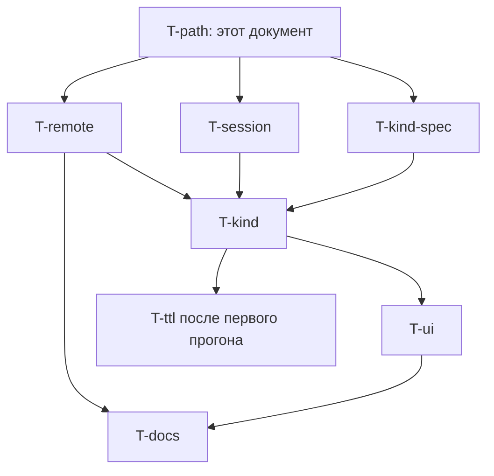

# Cloud implementer через pairing: полный путь и пакет задач

> Планировочный документ, не реализация.
> Контекст: оператор хочет, чтобы код `AH-…` открывал агенту в Cursor
> Cloud / iOS тот же конвейер, что MCP-исполнитель (`pair-start` →
> работа в git → `submit-for-review` / `report done`), а approve и
> review-verdict оставались человеческими действиями в хабе.
> Ревью подхода A (Claude Opus) запретило реализовывать флип #961 «как
> есть»: путь не проходит end-to-end, а мутация intake ломает закрытую
> задачу #961.
>
> **Новый эпик**, не расширение #958. #958 / #960 / #961 completed и
> про постановку задач из чата. Этот пакет — соседняя фича: облачный
> исполнитель на уже одобренной задаче.
>
> Заведено в хабе: эпик **#973**; F-remote **#974** / T-remote **#975**;
> F-session **#976** / T-session **#977**; F-pair **#978** / T-kind-spec
> **#979** / T-kind **#980** / T-ui **#981** / T-docs **#982** / T-ttl
> **#983**; T-path **#984**.
>
> Rev. 2 — правки по ревью спеки (C1–C6, I1–I12): схема кодов, persist
> `git_mode`, выдача только из `open`, revoke по `kind`, не `_AGENT_DEFAULT_PERMS`.
>
> **Rev. 3 — статус после выката (2026-08-27).** Это всё ещё планировочный
> документ пакета, не рантайм. В `main` уже: T-remote **#975**, T-session
> **#977**, T-kind **#980**, T-ui **#981**, T-docs **#982**. Осталось:
> T-kind-spec **#979** (полная SDD/AC), T-ttl **#983** (не стартовать до
> живого прогона на 2h), этот T-path **#984**. Черновик **#990** (CSRF
> cookie на карточке) — не этот пакет.

---

## 1. Целевой путь (to-be)

Один исполнимый сценарий. Всё, чего в нём нет, — не этот пакет.

```text
Оператор в хабе                Облачный агент (этот чат)           Хаб / git / GitHub
─────────────────────────      ──────────────────────────          ──────────────────
1. Задача в open
   (UI или intake chat-pair
    #961 — не ломаем)
2. Approve, если была draft
3. На карточке open-задачи:
   «Передать в облачный чат»
   → код AH-…, kind=implementer,
     bound_task_id=N
                               4. Redeem кода
                               5. whoami = agent / chat_pair
                                  acting principal = `cloud`
                                  perms = CHAT_PAIR_IMPLEMENTER_PERMS
                                  bound_task_id = N
                               6. POST /api/sessions/register
                                  (свой UUID session_id)
                               7. POST …/pair-start
                                  git_mode=remote, session_id,
                                  plan в теле (отдельный Plan-update
                                  не обязателен)
                                                                   8. status=running
                                                                      branch=task-N/slug
                                                                      git_mode=remote
                                                                      git на хосте хаба
                                                                      НЕ трогает
                                                                      (ни сейчас, ни на
                                                                      submit/done/CR)
                               9. В СВОЁМ клоне:
                                   checkout -b task-N/slug
                                   от origin/<base>
                               10. Код, тесты, коммиты
                               11. git push -u origin HEAD
                               12. POST …/submit-review
                                                                   13. PR, если у проекта
                                                                       настроен origin
                                                                       (иначе ответ явно
                                                                       говорит «не удалось»)
                                                                   14. CI
Оператор или reviewer-агент
(не этот чат):
15. review-verdict в хабе
                               16a. CHANGES_REQUESTED:
                                   фикс в той же ветке,
                                   снова submit-review
                                                                   16b. APPROVED:
                               17. POST updates kind=done
                                                                   18. completed
3'. Отзыв implementer — с
   карточки задачи или
   self-revoke. Кнопка на
   /chat-pair гасит только intake.
```

Claim из `open` **не обязателен**: `pair_start_task` штатно стартует из
`open` (`hub/services/lifecycle.py`). Claim остаётся в allowlist как
необязательный шаг, не как требование пути.

Человеческие гейты на всём пути: **approve, review-verdict, decide,
force-complete**. Этот канал их не вызывает и не получает.

---

## 2. Шаги: что есть сегодня и где дыра

Легенда: **есть** — работает в коде; **человек** — делается в UI хаба;
**дыра** — без новой задачи путь обрывается. Таблица ниже — анализ на момент
пакета; колонка статуса обновлена в rev. 3 после выката.

| # | Шаг | Статус | Почему |
|---|---|---|---|
| 1 | Создать задачу в `open` | **есть** (#961 intake) | Не ломаем. |
| 2 | Approve `draft` → `open` | **человек** | Implementer-каналу не нужен. |
| 3 | Выдать implementer-код на задачу N | **есть** (#980 / кнопка #981) | `POST /api/auth/chat-pair/start` с `{kind, task_id}` и CSRF POST с карточки `open`. Иначе 409. |
| 4 | Redeem | **есть** (#980) | Intake-ответ байт-совместим. Implementer: `role=agent`, `kind`, `bound_task_id`. |
| 5 | Агентская identity | **есть** (#980) | `acting_principal_id`, `kind`, `bound_task_id` на identity. |
| 6 | `POST /api/sessions/register` | **есть** (#977) | Чужой id → 409. Heartbeat чужой → 404. |
| 7 | Pair-start remote | **есть** (#975) | `git_mode=remote` персистится; git на хосте хаба skip на prepare/restore/CR. |
| 8–11 | Ветка и push в клоне агента | **есть у агента** | Хаб только записывает имя ветки. |
| 12–14 | Submit-for-review, PR, CI | **есть** (#980 allowlist) | PR — только если у проекта настроен origin; иначе явный отказ, не молчание. |
| 15 | Review-verdict | **человек** | Навсегда закрыт для канала. |
| 16–18 | Fix / done | **есть** (#980 allowlist) | `updates` kind=done. Self-review 403. |
| revoke | По `kind` | **есть** (#980) | Intake-кнопка `/chat-pair` гасит только intake. |

### Что путь сознательно не обещает

- Headless dispatch из облачного чата.
- Merge PR, `hub_decide_task`, `force_complete`.
- Reviewer-агент в том же токене.
- `/run-validation`, `/run-ac-tests` на хосте хаба — навсегда 403.
- `/mcp` для chat-pair.
- `refine` AC / `validation_commands` / `affected_areas` / `scope_*` / `project` после approve.
- Мутацию #961.

---

## 3. Implementer-токен

`auth_source=chat_pair` + **`kind`**. Intake (#961) не флипаем.

| | `kind=intake` (#961) | `kind=implementer` |
|---|---|---|
| Кто выдаёт | human, `/chat-pair` | human, **карточка задачи** |
| Контракт выдачи | `POST /api/auth/chat-pair/start` без тела | тот же URL **или** `POST /api/tasks/{id}/chat-pair/start` с `{kind: implementer, task_id}` — выбрать в T-kind-spec, один канон |
| Выдача из статусов | любой (как сейчас) | только `open`. Иначе 409. Между выдачей и redeem задача ушла из `open` → redeem 401 (тот же, что spent) |
| Привязка | принципал | принципал **и** `bound_task_id` |
| `role` | `human` (презентационно) | `agent` |
| Acting principal | issuer | `cloud`, не issuer, не `cursor` |
| Create | `open`, source=human | **запрещён** (нет в allowlist и нет в perms) |
| Claim / pair-start / updates / submit-review / done | 403 | только `bound_task_id`, и только пока вызывающий — holder (`claim_session_id` / `implementer_principal_id`) |
| Approve / decide / review-verdict / admin / `/mcp` / refine AC | 403 | 403 |
| Permissions | `CHAT_PAIR_PERMS` | `CHAT_PAIR_IMPLEMENTER_PERMS` = `{tasks.read, tasks.update, tasks.agent_report}`. **Не** `_AGENT_DEFAULT_PERMS` (там `tasks.create`). `tasks.human_gate` запрещён — иначе `is_human` True |
| TTL | 300 с / 7200 с | код 300 с; сессия 7200 с; **без renew**. Последняя живая implementer-сессия, истекшая или отозванная, возвращает bound `running`/`claimed` в `open`; мёртвый sibling не трогает задачу при живой сессии (#983) |
| Revoke | только `kind=intake` | только `kind=implementer` (+ `bound_task_id` с карточки). Self-revoke не гасит intake |

`env_get("CHAT_PAIR_AGENT")` → переменная **`HAIPLANE_CHAT_PAIR_AGENT`**.
Дефолт username **`cloud`**. Нет/неактивен → 503 `chat_pair_agent_missing`
**на выдаче кода**. На redeem — та же 401, что unknown/spent/expired
(503 после нахождения кода — оракул).

Burn неиспользованных кодов: в пределах
`(principal_id, kind, bound_task_id)`, не по одному `principal_id`.
Intake-код и implementer-код на другую задачу друг друга не гасят.

### Схема (добавить колонки, ничего не переименовывать)

```text
chat_pair_codes            -- миграция: kind, bound_task_id
  principal_id             -- issuer, КАК СЕЙЧАС
  kind                     -- 'intake' | 'implementer', DEFAULT 'intake'
  bound_task_id            -- NULL intake, NOT NULL implementer
  code_hash, expires_at, redeemed_at, created_at

chat_pair_sessions         -- миграция: acting_principal_id, kind, bound_task_id
  principal_id             -- issuer (атрибуция, audit, revoke), КАК СЕЙЧАС
  acting_principal_id      -- кто ходит в API; NULL для intake
  kind                     -- 'intake' | 'implementer', DEFAULT 'intake'
  bound_task_id            -- NULL intake, NOT NULL implementer
  token_hash, expires_at, revoked_at, created_at
```

`TokenIdentity` (`__slots__`) получает `chat_pair_kind` и
`chat_pair_task_id`. `_template_to_regex` **захватывает** `{task_id}`;
`chat_pair_route_allowed` сверяет сегмент с `bound_task_id` как int.
Нечисловой сегмент → 403 `chat_pair_gate_forbidden`, не 500.
Intake-allowlist компилируется отдельно и **не меняется**.

Расширение `ChatPairRedeemed`: для intake `role` и `permissions` как
сейчас (ассерты `tests/test_chat_pair.py`). Новые поля опциональны.

---

## 4. Remote pair-start — блокер (закрыт #975)

Отдельная feature: любой удалённый исполнитель, не только pairing.
**Выкатано в #975.** Ниже — исходный контракт, который T-remote реализовал.

```text
POST /api/tasks/{id}/pair-start
{
  "plan": "...",
  "session_id": "<uuid>",
  "assigned_agent": "cloud",
  "git_mode": "remote"     # hub|remote; default = текущее поведение (hub)
}
```

Имя поля **`git_mode`**, не `workspace`: `TaskView.workspace_mode` уже
`legacy|worktree`, `agent_sessions.workspace` — путь.

`git_mode` **персистится на задаче** (колонка + миграция `hub/db.py`).
Иначе последующие переходы не знают, что задача remote. Git-точки, все
должны skip при `remote`:

- pair-start → `prepare_pair_branch` (`orchestration.py`)
- submit-for-review → `_try_restore_pair_workspace` (`lifecycle.py`)
- release → то же
- updates kind=done → то же
- CHANGES_REQUESTED → `_try_switch_pair_workspace_to_task` (в worktree
  **создаёт** worktree на хосте)

При `git_mode=remote`: каноническое имя `task-{id}/{slug}` в
`tasks.branch`; `status → running`; `job_id` пустой; git_ops не
вызывается. Ответ содержит `branch` и подсказку создать ветку в своём
клоне от `origin/<project.default_branch>`.

Default / omitted = сегодняшний laptop path.

Предусловие PR: у проекта настроены `repo` / `gh_repo` / origin. Если
workspace на хосте — placeholder, дифф `None` и PR не открывается —
ответ **явно** это говорит (инвариант delivery-PR не вооружается на
`None`).

Scope-out T-remote: chat-pair allowlist, UI, #961, reserve branch,
merge с телефона.

---

## 5. Пакет задач



T-kind **не** открывает pair-start в allowlist, пока T-remote не в
`develop`. T-kind **не** открывает session routes, пока T-session не в
`develop`. Оба предусловия выполнены (#975 / #977 в `main`); T-kind #980
уже в проде.

### Иерархия в хабе

```text
epic  #973 Cloud-исполнитель без MCP          (новый, не #958)
  feature  #974 Remote pair-start
    task   #975 T-remote
  feature  #976 Владение session registry
    task   #977 T-session
  feature  #978 Implementer pairing
    task   #979 T-kind-spec
    task   #980 T-kind
    task   #981 T-ui
    task   #982 T-docs
    task   #983 T-ttl                         (не стартовать до живого прогона)
  task     #984 T-path                        (docs; этот PR)
```

### Минимальный allowlist implementer

```text
GET    /api/whoami
GET    /api/diagnostics/identity
GET    /api/tasks/{task_id}
GET    /api/tasks/{task_id}/tree
GET    /api/tasks/{task_id}/context
GET    /api/tasks/{task_id}/readiness
GET    /api/tasks/{task_id}/review-brief    # паритет с MCP; self_review_warning
GET    /api/tasks/{task_id}/acceptance_criteria
GET    /api/tasks/{task_id}/updates
POST   /api/tasks/{task_id}/updates         # plan / progress / done; holder only
POST   /api/tasks/{task_id}/question
POST   /api/tasks/{task_id}/claim           # необязателен; pair-start из open
POST   /api/tasks/{task_id}/pair-start      # после T-remote
POST   /api/tasks/{task_id}/submit-review   # holder only
POST   /api/tasks/{task_id}/declare-wait    # holder only
POST   /api/sessions/register
POST   /api/sessions/{session_id}/heartbeat
POST   /api/auth/chat-pair/redeem
POST   /api/auth/chat-pair/revoke           # kind=implementer + bound_task_id
```

Нет: `GET /api/tasks`, `POST /api/tasks`, `POST …/refine`,
`POST …/release` (release только из `claimed` и снова трогает git хоста),
`review-verdict`, `approve`, `decide`, `force-complete`, `/mcp`,
`/run-validation`, `/run-ac-tests`, projects, skills.

`session_id` агент генерирует сам (UUID).

---

## 6. Дополнения к существующим спекам

| Документ | Что | Когда |
|---|---|---|
| `docs/issues/task-961-chat-pair.md` | Intake заморожен (уже в шапке). Constraints: роль презентационная = только intake | T-kind-spec |
| `docs/software-development-workflow.md` | Третья строка pair-mode: Cloud VM / `git_mode=remote` | **T-remote** (не T-docs) |
| `docs/agent-mcp-operator-guide.md` | Раздел 4b; 4a не переписывать | T-docs |
| `docs/agent-context/invariants.md` | remote pair-start skip все git-точки; task-bound implementer; verdict не из chat-pair | T-remote + T-docs |
| `docs/agent-context/change-map.md` | Строка implementer **уже есть** — T-docs её обновляет, не добавляет; T-path дописывает ссылку на этот документ | T-docs + T-path |
| MCP catalog | Параметр `git_mode` у существующего `hub_pair_start`, не новый tool | T-remote |

---

## 7. Карточки (после ревью rev. 2)

Полные YAML для refine — в хабе при создании. Ниже — контракт каждой.

**Эпик** `work_type: feature`, size XL, новый (не #958).

**F-remote** → **T-remote** `work_type: feature` size L. Persist
`git_mode`. AC: pair-start не зовёт git_ops; omitted=`hub` как сейчас;
MCP+CLI тот же контракт; CR/submit/done не зовут restore/switch;
placeholder-workspace → явный «не удалось», не молча.

**F-session** → **T-session** `work_type: bug` size S. Register чужой
id → 409, строка A не меняется. Heartbeat чужой → **404** (уже так для
неизвестной сессии), `last_seen_at` не двигается.

**F-pair** → T-kind-spec `docs`; T-kind `feature` L (полный DoR, AC на
чужой task_id, выдачу не из open, self-revoke по kind, повторный redeem
401, missing `cloud` → 503 на start / 401 на redeem); T-ui `feature` S
(кнопка только на `open`); T-docs `docs`; T-ttl `feature` M — нет
renew, последняя живая implementer-сессия возвращает bound pair-задачу в `open`
(мёртвый sibling при живой сессии — нет).

T-kind `affected_areas` включает `hub/models.py`,
`hub/actionable_errors.py`, `hub/db.py`.

Порядок: T-remote ∥ T-session ∥ T-kind-spec → T-kind → T-ui → T-docs.
T-ttl после прогона.

Не делать: один PR «flip chat-pair to agent».
