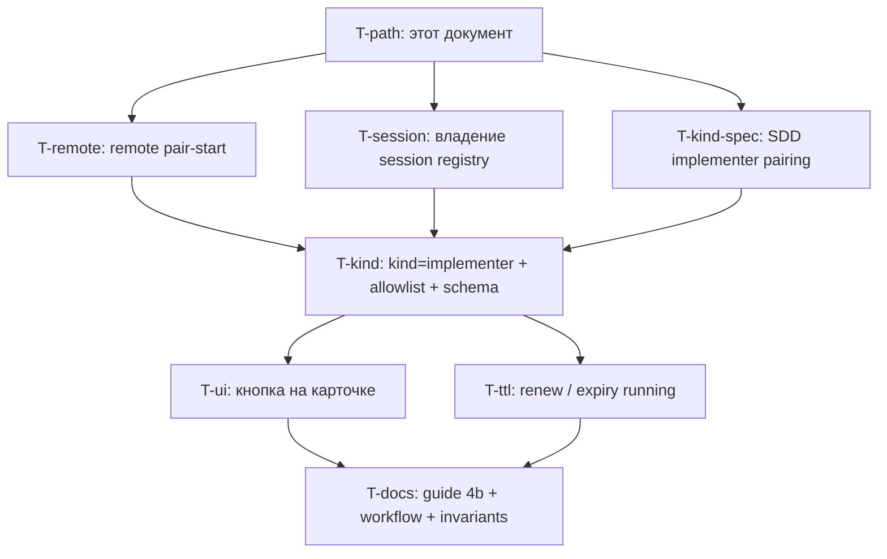

# Cloud implementer через pairing: полный путь и пакет задач

> Планировочный документ, не реализация.
> Контекст: оператор хочет, чтобы код `AH-…` открывал агенту в Cursor
> Cloud / iOS тот же конвейер, что MCP-исполнитель (`claim` → `pair-start`
> → работа в git → `submit-for-review` / `report done`), а approve и
> review-verdict оставались человеческими действиями в хабе.
> Ревью подхода A (Claude Opus) запретило реализовывать флип #961 «как
> есть»: путь не проходит end-to-end, а мутация intake ломает закрытую
> задачу #961.
>
> Родитель: эпик #958. Intake уже закрыт фичей #960 / задачей #961.
> Этот документ описывает **соседнюю** фичу, не замену #961.

---

## 1. Целевой путь (to-be)

Один исполнимый сценарий. Всё, чего в нём нет, — не этот пакет.

```text
Оператор в хабе                Облачный агент (этот чат)           Хаб / git / GitHub
─────────────────────────      ──────────────────────────          ──────────────────
1. Задача в open
   (создана в UI или intake
    chat-pair #961)
2. Approve, если была draft
3. На карточке: «Передать
   в облачный чат» → код
   AH-…, привязан к task_id
                               4. Redeem кода
                               5. whoami = agent / chat_pair
                                  principal = `cloud`
                                  permissions = agent defaults
                                  bound_task_id = N
                               6. POST /api/sessions/register
                                  (свой UUID session_id)
                               7. Plan: … (update)
                               8. POST …/claim
                               9. POST …/pair-start
                                  workspace=remote, session_id
                                                                   10. status=running
                                                                       branch=task-N/slug
                                                                       git на сервере
                                                                       хаба НЕ трогает
                               11. В СВОЁМ клоне:
                                   checkout -b task-N/slug
                                   от origin/<base>
                               12. Код, тесты, коммиты
                               13. git push -u origin HEAD
                               14. POST …/submit-review
                                                                   15. PR (ensure_delivery_pr
                                                                       по origin)
                                                                   16. CI
Оператор или reviewer-агент
(не этот чат):
17. review-verdict в хабе
                               18a. CHANGES_REQUESTED:
                                   фикс в той же ветке,
                                   снова submit-review
                                                                   18b. APPROVED:
                               19. POST updates kind=done
                                                                   20. completed
3'. «Отозвать чат-сессии»
   или агент self-revoke
```

Человеческие гейты на всём пути: **approve, review-verdict, decide,
force-complete**. Этот канал их не вызывает и не получает.

---

## 2. Шаги: что есть сегодня и где дыра

Легенда: **есть** — работает в коде; **человек** — делается в UI хаба;
**дыра** — без новой задачи путь обрывается.

| # | Шаг | Статус | Почему |
|---|---|---|---|
| 1 | Создать задачу в `open` | **есть** (#961 intake) | Chat-pair сегодня: `role=human`, create → `open`. Это **не** ломаем. |
| 2 | Approve `draft` → `open` | **человек** | Уже UI/MCP human. Implementer-каналу не нужен. |
| 3 | Выдать код, привязанный к задаче N | **дыра** | `/chat-pair` выдаёт глобальный код принципала, не `task_id`. |
| 4 | Redeem | **есть** | Публичный `POST /api/auth/chat-pair/redeem`. Контракт ответа надо расширить (`kind`, `bound_task_id`, `role=agent`). |
| 5 | Агентская identity | **дыра** | `resolve_session` форсит `role=human` и `principal_id` = issuer (`hub/services/chat_pair.py`). |
| 6 | `POST /api/sessions/register` | **дыра** | Маршрута нет в allowlist. Плюс upsert перезаписывает чужой `principal_id` (`hub/repository.py` register). |
| 7 | Plan update | **дыра** | `POST /api/tasks/{id}/updates` нет в allowlist. |
| 8 | Claim | **дыра** | Allowlist + сегодняшняя human-роль. Агенту нужен `session_id` (#852). |
| 9–10 | Pair-start **без** git на хосте хаба | **дыра, блокер пути** | `prepare_pair_branch` checkout'ит `WORKSPACE_REPO_LINK` на сервере (`hub/services/orchestration.py`). Облачная VM в этом клоне не работает. Явно scope-out #961 (`adopt_branch`). |
| 11–13 | Веткa и push в клоне агента | **есть у агента** | Это git агента, не хаба. Хаб должен только **записать имя** ветки. |
| 14–16 | Submit-for-review, PR, CI | **дыра** на allowlist; PR-путь хаба **есть** (читает origin) | `ensure_delivery_pr` уже предпочитает remote ref. Нужен предшествующий push агента. |
| 17 | Review-verdict | **человек** (или отдельный reviewer) | Маршрут **навсегда закрыт** для этого канала. `ensure_reviewer_independence` на не-агенте коротко замыкается — открыть verdict = дыра в Universal Review Gate. |
| 18–20 | Fix / done | **дыра** на allowlist | `updates` kind=done. После APPROVED — штатный post-done. |
| revoke | Отозвать сессию | **есть, сломается** при раздвоении principal | `revoke` ключ сейчас = `identity.principal_id`. Если identity станет агентом, а строки — человеком, self-revoke отзовёт 0 сессий и вернёт 200. |

### Что путь сознательно не обещает

- Headless dispatch (`hub_start_task` / `oc-dev-dispatch`) из облачного чата.
- Merge PR, `hub_decide_task`, `force_complete`.
- Reviewer-агент в том же токене (отдельный kind, если когда-нибудь понадобится).
- Выполнение `validation_commands` / AC-тестов **на хосте хаба** (`/run-validation`, `/run-ac-tests`) — для этого канала навсегда 403: канал умеет refine, то есть умел бы подставить команды.
- Открытие `/mcp`: cloud MCP не подключает; утёкший токен в MCP-клиенте получил бы весь каталог.
- Мутацию #961: intake «поставить задачу с телефона в `open`» остаётся.

---

## 3. Как должен выглядеть implementer-токен

Не «человек с узкими правами» и не «admin в облаке». Третье состояние
сохраняется (`auth_source=chat_pair`), но появляется **`kind`**.

| | `kind=intake` (#961, без изменений) | `kind=implementer` (новое) |
|---|---|---|
| Кто выдаёт | залогиненный human, страница `/chat-pair` | залогиненный human, **карточка задачи** в `open` |
| Привязка | принципал | принципал **и** `task_id` |
| `role` в whoami | `human` (презентационно) | `agent` |
| Acting principal | issuer (атрибуция create) | выделенный агент `cloud`, не issuer, не `cursor` |
| Create | `open`, source=human | **запрещён** (задача уже есть) |
| Claim / pair-start / updates / submit-review / done | 403 | только для `bound_task_id` |
| Approve / decide / review-verdict / admin / `/mcp` | 403 | 403 |
| TTL кода / сессии | 300 с / 7200 с | код 300 с; сессия — см. задачу T-ttl (2 ч мало для прогона) |
| Revoke | по issuer | по `issuer_principal_id`; self-revoke смотрит issuer, не acting |

Схема сессии (миграция, не reuse одной колонки):

```text
chat_pair_sessions
  issuer_principal_id   -- кто выдал, кто отзывает
  acting_principal_id   -- кто ходит в API (cloud)
  kind                  -- intake | implementer
  bound_task_id         -- NULL для intake, NOT NULL для implementer
  token_hash, expires_at, revoked_at, created_at
```

Allowlist implementer сверяет `{task_id}` в пути с `bound_task_id`.
Чужой id → 403 `chat_pair_gate_forbidden` (тот же reason, без оракула).

`CHAT_PAIR_AGENT` (env, без префикса в `env_get`) указывает username
acting-принципала. Дефолт **`cloud`**, не `cursor`: иначе ноутбучный и
облачный исполнитель разделят `implementer_principal_id` и сломают
self-review между собой. Нет/неактивен принципал → 503
`chat_pair_agent_missing` на start и redeem, не безликий 401.

---

## 4. Remote pair-start — блокер, не деталь chat-pair

Без этого шага 9–13 не существуют. Это **отдельная** feature хаба: любой
удалённый исполнитель (cloud, другая машина), не только pairing.

Контракт (черновик, уточняется в спеке T-remote):

```text
POST /api/tasks/{id}/pair-start
{
  "plan": "...",             # или предшествующий update "Plan:"
  "session_id": "<uuid>",    # обязателен для is_agent
  "assigned_agent": "cloud",
  "workspace": "remote"      # новое; default сохраняет сегодняшнее поведение
}
```

Когда `workspace=remote`:

- хаб **не** вызывает `prepare_pair_branch` / checkout / clean / push с сервера;
- записывает каноническое имя `task-{id}/{slug}` в `tasks.branch`;
- `status → running`, `job_id` пустой, `implementer_principal_id` acting,
  `claim_session_id` = session;
- ответ содержит `branch` и подсказку агенту: создать эту ветку от
  `origin/<project.default_branch>` в **своём** клоне и пушить туда.

Сегодняшний вызов без `workspace` (и MCP `hub_pair_start` с ноутбука)
остаётся legacy: git на `HAIPLANE_WORKSPACE_REPO`.

Агент после remote pair-start:

```bash
git fetch origin
git checkout -b task-<id>/<slug> origin/<base>
# work, commit
git push -u origin HEAD
# затем POST /api/tasks/<id>/submit-review
```

`ensure_delivery_pr` и `branch_diff_paths` уже читают origin — после
push агента хаб может открыть PR, не имея локальных коммитов.

Scope-out T-remote: reserve branch, merge с телефона, перенос
unpushed-хвоста с чужой машины.

---

## 5. Пакет задач

Одна исполняемая задача — одна ветка. Порядок — по зависимостям пути.
Спеки пишутся **до** кода; T-path (этот документ) — вход.



T-remote и T-session независимы и могут идти параллельно. **T-kind не
открывает pair-start в allowlist, пока T-remote не в `develop`.** Иначе
облачный redeem снова checkout'ит клон хаба.

### T-path — docs (этот PR)

Зафиксировать путь, дыры и пакет. Не код.

### T-remote — `work_type: feature`, size L, зависимость пути #9–13

Нужна **отдельная полная SDD-спека** (как #961), не абзац в этом файле.
В спеке обязательно:

- поле/enum `workspace` на `TaskPairStart` + MCP `hub_pair_start` + CLI
  в одном проходе (контракт);
- default = текущее поведение (не ломать ноут);
- remote: ноль git-мутаций на хосте хаба, каноническое имя ветки,
  409/422 если задача уже `running` с другой веткой;
- что делать, если ветка уже есть на origin (adopt vs 422);
- взаимодействие с `worktree_per_task` (remote его не включает);
- AC: unit без реального git-хоста + хотя бы один тест, что
  `plugins.git_ops.checkout` / `pair_prepare_branch` **не** вызываются;
- docs: третья строка таблицы в `docs/software-development-workflow.md`
  «Pair mode: git policy» — Cloud VM.

`scope_out`: chat-pair allowlist, UI кнопки, изменение #961.

### T-session — `work_type: bug`, size S, hardening до открытия маршрутов

`POST /api/sessions/register` при конфликте `session_id` не должен
перезаписывать `principal_id`/`agent` чужой сессии. Heartbeat — только
владелец (или 404, неотличимо). Иначе implementer-токен из транскрипта
перехватывает адрес ноутбучного агента.

Можно вливать в `develop` до T-kind. T-kind **не** добавляет session
routes в allowlist, пока это не зелёное.

### T-kind-spec — `work_type: docs` / вход T-kind

Полная SDD implementer pairing (rev. 1), наследник структуры #961:

- `kind`, две колонки principal, `bound_task_id`;
- два скомпилированных allowlist, **перечень маршрутов один в один**
  (не формула «всё, что делают агенты через MCP»);
- таблица «закрыто навсегда и почему», включая `/run-validation`,
  `/run-ac-tests`, `review-verdict`, `approve`, `decide`,
  `force-complete`, `/mcp`, `POST /api/projects`, create на implementer;
- форс identity: acting=`cloud`, issuer для audit/revoke;
- 503 `chat_pair_agent_missing`;
- create на implementer → 403 (задача уже выбрана); intake не трогать;
- AC на: чужой `task_id` в пути, self-revoke, повторный redeem,
  истечение, отсутствие принципала `cloud`;
- явная правка Constraints #961: для intake роль по-прежнему
  презентационная; для implementer гейты смотрят `kind` + allowlist +
  `is_agent`, не наследуют права issuer.

Дополнения к #961 (короткий changelog в том же файле): *intake
заморожен; соседний kind живёт рядом; этот канал не флипаем в агента.*

### T-kind — `work_type: feature`, size L

Реализация T-kind-spec. Зависит от T-remote и T-session.

Минимальный allowlist implementer (метод + путь, якоря как в #961):

```text
GET    /api/whoami
GET    /api/diagnostics/identity
GET    /api/tasks/{task_id}
GET    /api/tasks/{task_id}/tree
GET    /api/tasks/{task_id}/context
GET    /api/tasks/{task_id}/readiness
GET    /api/tasks/{task_id}/review-brief
GET    /api/tasks/{task_id}/acceptance_criteria
GET    /api/tasks/{task_id}/updates
POST   /api/tasks/{task_id}/updates
POST   /api/tasks/{task_id}/refine
POST   /api/tasks/{task_id}/question
POST   /api/tasks/{task_id}/claim
POST   /api/tasks/{task_id}/pair-start          # только после T-remote
POST   /api/tasks/{task_id}/submit-review
POST   /api/tasks/{task_id}/declare-wait
POST   /api/tasks/{task_id}/release
POST   /api/sessions/register
POST   /api/sessions/{session_id}/heartbeat
POST   /api/auth/chat-pair/redeem
POST   /api/auth/chat-pair/revoke
```

Список задач (`GET /api/tasks`) — **нет**: токен знает одну задачу.
Inbox через этот канал не нужен и расширяет blast radius.

`session_id` агент **генерирует сам** (UUID) в этом чате, регистрирует,
повторяет в claim / pair-start / heartbeat. Это пишется в guide 4b и в
подсказку redeem-ответа, не угадывается.

Bootstrap: миграция/seed принципала `cloud` с ролью `agent`.

### T-ui — `work_type: feature`, size S

На карточке задачи в `open` (и `claimed` собой?): кнопка «Передать в
облачный чат» → код `AH-…` + `task #N` + TTL. CSRF как на `/chat-pair`.
Страница `/chat-pair` **остаётся intake** (копия про постановку задач
остаётся правдой). Счётчик живых сессий различает kind.

Зависит от T-kind (без схемы кнопке нечего выдавать).

### T-ttl — `work_type: feature`, size M

2 часа мало для cloud-прогона. Варианты (выбрать в спеке задачи, не
здесь): renew того же kind в пределах потолка (например 8 ч суммарно);
или по истечении задача `running` → явное правило watchdog / release.
Молчаливый «агент умер, задача висит» — уже отдельный боль (#971 в
проде); этот канал не должен его усиливать.

Не смешивать с T-kind: сначала канал с текущим TTL, затем политика
жизни, если первый живой прогон упрётся в expiry.

### T-docs — `work_type: docs`, size S

Когда T-kind + T-ui + T-remote в `develop`:

- `docs/agent-mcp-operator-guide.md` — раздел **4b Cloud implementer**
  (отдельный от 4a intake);
- `docs/software-development-workflow.md` — третья строка pair-mode
  (Cloud VM / remote);
- `docs/agent-context/invariants.md` — remote pair-start не трогает
  клон хаба; chat-pair implementer task-bound;
- `docs/agent-context/change-map.md` — строка implementer pairing
  (черновик строки — ниже, в этом PR).

---

## 6. Дополнения к существующим спекам и докам

| Документ | Что добавить | Когда |
|---|---|---|
| `docs/issues/task-961-chat-pair.md` | Changelog: intake заморожен; не флипать в агента; соседний `kind=implementer` описан здесь | T-kind-spec |
| `docs/issues/task-961-chat-pair.md` Constraints | Уточнить «роль презентационная» = только intake | T-kind-spec |
| `docs/software-development-workflow.md` | Сценарий Cloud VM в таблице pair mode; `workspace=remote` | T-remote |
| `docs/agent-mcp-operator-guide.md` | 4b; 4a не переписывать под агента | T-docs |
| `docs/agent-context/invariants.md` | Remote pair-start; task-bound implementer; review-verdict не из chat-pair | T-remote + T-docs |
| `docs/agent-context/change-map.md` | Отдельная строка implementer (не расширять строку #961 «по ходу») | этот PR (якорь) + T-kind |
| `hub/templates/chat_pair.html` | Не менять смысл intake-копии | T-ui (карточка, не эта страница) |
| MCP catalog | Не расти. Remote pair-start = параметр существующего `hub_pair_start`, не новый tool. Считать бюджет. | T-remote |

High-risk coupling из change-map остаётся в силе: расширять allowlist
только задачей, у которой это в scope, с перечнем маршрутов в AC.

---

## 7. Готовые карточки в хаб

Ниже — черновики refine. Не создавать в хабе, пока T-path не принят
оператором. `outcome_*` — Discovery, advisory.

### Эпик (если #958 узкий «только постановка»)

```yaml
title: Cloud-исполнитель без MCP
task_type: epic
work_type: feature
user_story: |
  As an operator, I want to hand an approved hub task to a Cursor cloud
  agent via a short pairing code, so the agent can implement without
  laptop MCP while I keep approve and review in the hub.
scope_in:
  - remote pair-start
  - task-bound implementer chat-pair kind
  - session registry ownership
  - task-card pairing UI
  - operator docs 4b
scope_out:
  - mutating #961 intake into an agent session
  - reviewer-агент в том же токене
  - headless dispatch from cloud chat
  - /mcp for chat-pair
```

### T-remote

```yaml
title: Remote pair-start — ветка без git-мутаций на хосте хаба
task_type: task
work_type: feature
class_of_service: standard
size: L
wip_tag: feature_work
redesign_decision: redesign
redesign_rationale: >
  pair-start сегодня готовит ветку в HAIPLANE_WORKSPACE_REPO на сервере.
  Облачный исполнитель работает в другом клоне; checkout на хабе —
  побочный эффект не тому актору и 422 по грязному дереву, которое
  агент не может починить. Нужен режим, где хаб только записывает имя
  ветки, а git делает исполнитель.
agent_fit: sdd_native
user_story: |
  As a remote implementer, I want pair-start to record the canonical
  branch name without touching the hub host clone, so I can create and
  push that branch from my own workspace.
problem_statement: |
  prepare_pair_branch checkouts WORKSPACE_REPO_LINK. Cloud/iOS agents
  cannot use that tree. #961 listed adopt_branch as scope-out; without
  it the "approve then take" path cannot reach running usefully.
business_value: |
  Unblocks any remote pair implementer, including future chat-pair
  implementer. Laptop pair-start stays unchanged.
scope_in:
  - TaskPairStart.workspace = local|remote (default local/current)
  - remote skips prepare_pair_branch and records task-<id>/<slug>
  - REST + MCP hub_pair_start + CLI in one pass
  - tests that git_ops checkout/prepare are not called on remote
  - workflow doc: Cloud VM row
scope_out:
  - chat-pair allowlist and UI
  - reserve branch, phone merge, unpushed foreign clone recovery
affected_areas:
  - hub/models.py
  - hub/services/lifecycle.py
  - hub/services/orchestration.py
  - hub/mcp_server.py
  - hub/cli.py
  - docs/software-development-workflow.md
validation_commands:
  - uv run ruff check hub tests
  - uv run ruff format --check hub tests
  - uv run pytest -q tests/test_services.py tests/test_api.py tests/test_mcp_server.py tests/test_cli.py
  - uv run python scripts/mcp_catalog_budget.py
  - uv run python scripts/surface_parity.py
acceptance_criteria:
  - id: AC-1
    given: open task, agent caller with session_id, workspace=remote
    when: POST /api/tasks/{id}/pair-start
    then: status=running, branch=task-{id}/<slug>, git_ops.pair_prepare_branch and checkout were not invoked
    verifiable_by: test
  - id: AC-2
    given: same task, workspace omitted or local
    when: pair-start
    then: current prepare_pair_branch path runs unchanged
    verifiable_by: test
  - id: AC-3
    given: MCP hub_pair_start with workspace=remote
    when: tool call
    then: same REST behavior; tools/list budget still under ceiling
    verifiable_by: test
```

### T-session

```yaml
title: Session register не отдаёт чужой session_id
task_type: task
work_type: bug
class_of_service: standard
size: S
wip_tag: bugfix
user_story: |
  As the owner of an agent session, I want register/heartbeat to refuse
  a session_id that already belongs to another principal, so a leaked
  chat-pair token cannot hijack my address.
problem_statement: |
  register upserts principal_id and agent on session_id conflict.
  heartbeat has no owner check. Harmless while callers are trusted
  laptop tokens; fatal once a transcript-borne token can call these
  routes.
business_value: |
  Closes the hijack before implementer pairing opens the routes.
scope_in:
  - owner check on register conflict and heartbeat
  - tests for same-principal refresh vs other-principal 409/404
scope_out:
  - chat-pair allowlist
  - pair-start git
affected_areas:
  - hub/repository.py
  - hub/services/sessions.py
  - hub/app.py
validation_commands:
  - uv run pytest -q tests/test_api.py tests/test_auth.py
acceptance_criteria:
  - id: AC-1
    given: session_id registered to principal A
    when: principal B POSTs /api/sessions/register with that id
    then: 409, A's row unchanged
    verifiable_by: test
  - id: AC-2
    given: session_id registered to A
    when: B POSTs /api/sessions/{id}/heartbeat
    then: 404 or 403, last_seen_at unchanged
    verifiable_by: test
```

### T-kind (после T-kind-spec, T-remote, T-session)

```yaml
title: Chat-pair kind=implementer — агентская сессия на одну open-задачу
task_type: task
work_type: feature
size: L
wip_tag: feature_work
redesign_decision: redesign
redesign_rationale: >
  Флип #961 в агента ломает intake, revoke и git. Соседний kind на том
  же механизме кода сохраняет постановку с телефона и даёт облачному
  исполнителю claim/pair-start/done только по bound_task_id.
user_story: |
  As a cloud Cursor agent, I want to redeem a task-bound pairing code
  and run the implementer conveyor on that task via REST, so I do not
  need Hub MCP.
scope_in:
  - kind, issuer/acting principals, bound_task_id
  - seed principal cloud
  - implementer allowlist as listed in this path doc
  - start from task-card API (web can wait for T-ui)
scope_out:
  - changing intake behavior or /chat-pair copy
  - review-verdict, approve, /mcp, run-validation
  - TTL redesign (T-ttl)
  - implementing T-remote itself
affected_areas:
  - hub/services/chat_pair.py
  - hub/auth.py
  - hub/app.py
  - hub/db.py
  - hub/config.py
  - tests/test_chat_pair.py
validation_commands:
  - uv run pytest -q tests/test_chat_pair.py tests/test_auth.py tests/test_db_migrations.py
  - uv run python scripts/surface_parity.py
```

T-ui, T-ttl, T-docs — по разделу 5; refine после приёмки T-kind.

---

## 8. Порядок работ для оператора

1. Принять этот путь (T-path) — intake живёт, implementer соседний,
   remote pair-start обязателен.
2. Завести в хабе эпик + T-remote, T-session, T-kind-spec (можно
   параллельно после approve).
3. Не стартовать T-kind, пока T-remote и T-session не в `develop`.
4. T-ui и T-docs — после первого зелёного T-kind.
5. T-ttl — по факту первого живого облачного прогона, если 2 ч не хватит.

Не делать: один PR «flip chat-pair to agent». Ревью это уже отвергло.
