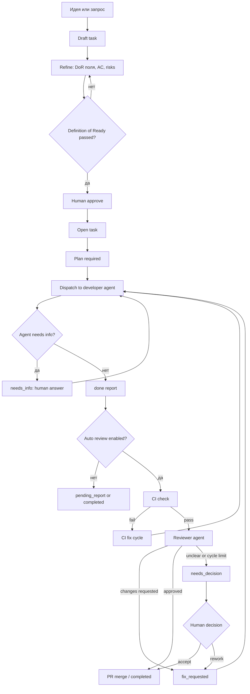

# Путь разработки ПО через Haiplane Hub

## Цель

Haiplane Hub должен быть общей контрольной плоскостью для работы людей и AI-агентов из Cursor. Люди формулируют намерение, утверждают готовность задач, отвечают на вопросы, принимают спорные решения и контролируют результат. Агенты помогают разбирать требования, готовить задачи, писать код, проверять изменения и возвращать отчеты в хаб.

Хаб не заменяет git, CI и ревью. Он связывает их в один наблюдаемый жизненный цикл: от идеи до PR, проверки, доработок и завершения.

## Рабочая модель

У проекта есть две разные среды:

- **Hub repo**: этот репозиторий, где живет сервер хаба, Web UI, REST API, CLI и MCP.
- **Workspace repo**: рабочий git-репозиторий продукта, с которым будут работать агенты. Он задается через `HAIPLANE_WORKSPACE_REPO`.

Все люди и агенты должны видеть один и тот же хаб. Cursor подключается к MCP-поверхности хаба, а хаб уже обращается к REST API, базе, dispatch, git, GitHub, notes и transcripts через плагины.

## Роли

**Человек-заказчик**

Формулирует цель, приоритеты и ограничения. Принимает результат в продуктовых терминах.

**Человек-техлид**

Утверждает готовность задачи, контролирует риски, решает спорные ситуации, принимает или отправляет на доработку результаты после арбитража.

**Architect Analyst agent**

Превращает сырую идею в готовую задачу: выбирает `work_type`, уточняет `scope_in`, `scope_out`, acceptance criteria, validation commands, risks и добивается прохождения Definition of Ready.

**Developer agent**

Берет утвержденную задачу, читает контекст через хаб, пишет план, выполняет изменение в workspace repo, отправляет статусные обновления и `done`-отчет.

**Testing agent**

Проверяет поведение, дописывает или запускает тесты, фиксирует команды в задаче и сообщает регрессионные риски.

**Code Reviewer agent**

Проверяет diff и контрактные риски: API, CLI, MCP, схему, миграции, жизненный цикл, тесты.

## Единица работы

Базовая единица - task или subtask. Epic и feature задают структуру, но не должны автоматически уходить агенту в работу.

Иерархия:

```text
epic -> feature -> task -> subtask
```

Каждая исполняемая задача должна содержать:

- `work_type`;
- краткое описание проблемы или пользовательской ценности;
- явный `scope_in` и при необходимости `scope_out`;
- acceptance criteria в формате Given/When/Then;
- validation commands;
- размер (`size`) и при необходимости `wip_tag`;
- риски и mitigation, если есть неопределенность;
- ограничения для ревью, если reviewer должен что-то игнорировать.

## Основной жизненный цикл



## Сценарий 1: человек поручает работу агенту

1. Человек создает feature/task в Web UI, CLI или Cursor через MCP.
2. Analyst agent уточняет задачу через `hub_refine_task`, `hub_add_acceptance_criterion`, `hub_add_risk`.
3. Человек смотрит `hub_get_readiness` или readiness в UI.
4. Если DoR проходит, человек утверждает задачу.
5. Перед стартом должен быть план: `hub_start_task(..., plan="...")` или отдельный update с `Plan:`.
6. Developer agent берет контекст через `hub_my_context`, работает в workspace repo и пишет updates.
7. Если агенту не хватает данных, он вызывает `hub_ask_question`; человек отвечает через UI или `hub_answer_question`.
8. Агент отправляет `hub_report_done` с тем, что изменено и как проверено.
9. Хаб прогоняет CI/review/fix cycles. Человек вмешивается только при `needs_info`, `needs_decision`, stale, failed или force-complete.

## Сценарий 2: агент предлагает работу человеку

1. Агент видит проблему, недостающий тест, долг или уточнение и создает draft через `hub_propose_task`.
2. Draft не исполняется автоматически.
3. Analyst agent или человек доводит draft до готовности.
4. Человек выбирает одно из действий:
   - approve: задача становится `open`;
   - approve + run: задача сразу стартует после утверждения;
   - reject: предложение отклоняется с комментарием;
   - force approve: допускается только как осознанное исключение через API/CLI/Web, хаб пишет audit update.

## Сценарий 3: человек контролирует результат агента

Контроль должен быть по состояниям, а не через ручной мониторинг чатов.

В Inbox должны попадать:

- `draft`: агент предложил задачу, нужен approve/reject;
- `needs_info`: агент задал вопрос;
- `pending_report`: работа завершилась, но нет нормального done-отчета;
- `needs_decision`: review/CI/arbiter не смогли автоматически закрыть задачу;
- stale running tasks: агент долго не обновлял статус.

Для приемки человек проверяет:

- есть ли done report;
- выполнены ли acceptance criteria;
- совпадают ли фактические validation commands с заявленными;
- есть ли PR и прошел ли CI;
- не исчерпаны ли review/CI fix cycles;
- есть ли force overrides или alerts в update log.

## Контракт Cursor + Hub

В Cursor агентам нужно дать правило: хаб является источником правды по задачам и статусам.

Минимальный набор MCP-инструментов для ежедневной работы:

- `hub_project_status` - обзор очереди, вопросов, ревью, решений и PR;
- `hub_list_tasks` / `hub_task_status` - поиск и детализация задач;
- `hub_my_context` - контекст задачи перед работой;
- `hub_refine_task` - уточнение структурных полей;
- `hub_add_acceptance_criterion` / `hub_replace_acceptance_criteria` - критерии приемки;
- `hub_add_risk` - фиксация рисков;
- `hub_get_readiness` - проверка DoR;
- `hub_approve_task` / `hub_reject_task` - человеческий gate;
- `hub_start_task` - headless dispatch (path A) только после плана;
- `hub_pair_start` - pair mode (path B): `running` без `oc-dev-dispatch`, см. [Pair mode: git policy](#pair-mode-git-policy);
- `hub_task_update`, `hub_ask_question`, `hub_report_done` - отчетность агента;
- `hub_decide_task` - человеческое решение после арбитража.

Агентам не стоит обходить хаб, если действие влияет на состояние задачи. Код можно менять в workspace repo, но намерение, вопросы, блокеры, done report и решения должны возвращаться в хаб.

Force approve доступен единым контрактом через MCP (`hub_approve_task(..., force=True)`), REST API (`POST /api/tasks/{id}/approve` с `force: true`), CLI (`oc-hub approve --force`) и Web UI (форма `web-approve` с `force=true`). Любой force approve является audited human override: он оставляет alert-update в задаче и запись в activity log, что обеспечивает трассируемость причин обхода DoR.

## Definition of Ready как главный входной gate

До старта задачи хаб должен отвечать на вопрос: "может ли разработчик-агент выполнить работу без дополнительного интервью?".

Поэтому `draft -> open` проходит через DoR:

- если required checks не пройдены, approve возвращает 422;
- force approve разрешен, но должен быть редким и аудируемым;
- readiness score полезен для улучшения задачи, но сам по себе не заменяет missing required checks;
- разные `work_type` имеют разные DoR-профили, поэтому bug, chore, docs, spike и incident не надо насильно доводить до feature-уровня детализации.

## Human gates

Обязательные точки человеческого контроля:

1. **Approval gate**: перевод `draft -> open`.
2. **Start gate**: наличие плана перед dispatch.
3. **Question gate**: ответ на `needs_info`.
4. **Decision gate**: `needs_decision` после blocker, review ambiguity, CI/review cycle limit или arbiter.
5. **Force gate**: любой `force=true` должен иметь комментарий и оставлять audit trail.
6. **Completion gate for weak reports**: `pending_report` нельзя считать завершенным без понятного отчета или явного force-complete.

## Universal Review Gate

**Серверное правило, а не конвенция клиента:** хаб не завершает задачу ни
одним нормальным путём, пока у **текущего** сабмишена работы нет вердикта
APPROVED. Правило применяется в общем service-слое (`completion_requires_review`),
поэтому действует одинаково для REST, MCP, CLI и поллера — в любом клиенте.

Цикл ревью один для всех сред:

1. Разработчик заканчивает итерацию и отправляет работу:
   `hub_submit_for_review` (или done-report — хаб сам маршрутизирует его в
   `review`, если одобрения ещё нет). Каждая отправка получает новый
   submission generation.
2. Ревьюер получает полный контекст одним вызовом `hub_get_review_brief`:
   acceptance criteria, scope, validation commands, review checklist,
   branch/PR c advisory diff-командой, последний отчёт разработчика.
   База диффа берётся из `default_branch` проекта и проверяется на
   резолвинг в его воркспейсе (#725): три состояния — `resolved`,
   `unresolved` (посмотрели, ветки нет) и `unverified` (смотреть было
   негде). При `unresolved` команда не выдаётся вовсе, причина стоит на её
   месте, а блоки, которые читают дифф, говорят, что отключены именно ею.
   Блок `evidence_coverage` подводит итог по всем блокам доказательств:
   сколько дали сигнал, что не отработало и почему. `sha_check: match`
   в этот счёт не входит — он сравнивает, куда указывает ветка, а не код.
3. Ревьюер выносит вердикт `hub_submit_review`: `approved` или
   `changes_requested` со структурированными findings (стабильные id,
   severity high/medium/low).
4. При `changes_requested` задача возвращается в `running`; разработчик
   исправляет findings по номерам и отправляет работу снова. Прежний
   вердикт при этом протухает автоматически (generation вырос).
5. Только при APPROVED для текущего сабмишена `hub_report_done` завершает
   задачу. Лимит review-циклов без одобрения эскалирует в `needs_decision`.

Явный опт-аут — `auto_review=false` (по умолчанию у subtask): такие задачи
завершаются без ревью, и это решение человека на этапе создания/одобрения.
Human-переопределения (`hub_decide_task` accept, `hub_force_complete_task`)
обходят гейт сознательно и остаются в audit trail.

### Как запускается ревьюер в разных клиентах

Инвариант везде один; различается только механика запуска ревьюера:

- **Cursor** — второй агент/композер в отдельном чате или другой человек:
  открывает `hub_get_review_brief`, смотрит diff по advisory-команде,
  выносит `hub_submit_review`.
- **Codex** — отдельный reviewer-запуск (или другая сессия) с теми же двумя
  инструментами; вердикт — только через `hub_submit_review`, не через
  свободный текст в updates.
- **Claude Code** — субагент или отдельная сессия в роли
  `agents/code-reviewer.md`; человек-ревьюер может отдать вердикт через
  CLI (`oc-hub review-brief`, `oc-hub review-verdict`) или API.

Ревьюер **не** одобряет/мержит PR и не завершает задачу — его выход только
вердикт. Исполнитель не должен выносить вердикт собственной работе
(серверное принуждение — задача #318).

## Branch, PR и CI

Для каждой исполняемой задачи хаб создает или переиспользует branch вида `task-<id>/<slug>` через git ops plugin.

Рекомендуемый порядок:

1. Developer agent работает только в branch задачи.
2. После done хаб auto-commit, squash, push и создает PR, если это возможно.
3. CI проверяется до reviewer agent.
4. Если CI падает, задача возвращается в developer agent через CI fix cycle.
5. Если CI проходит, запускается reviewer agent.
6. После approval и успешного CI хаб может merge PR и завершить задачу.

Если branch/PR/CI не удалось создать или интерпретировать, задача должна уходить в `needs_decision`, а не молча считаться выполненной.

Формальные инварианты (один branch на задачу, запрет касания чужого branch, out-of-scope — только draft proposal, конфликт → `needs_decision`) описаны в [workspace-safety-policy.md](workspace-safety-policy.md).

## Pair mode: git policy

Path B — человек + Cursor-агент без headless dispatch (`hub_pair_start`). Хаб переводит задачу в `running` и может создать branch через git ops plugin в каталоге `HAIPLANE_WORKSPACE_REPO`. **Исходный код и коммиты остаются ответственностью разработчика в git**, не хаба.

### Два типичных сценария

| Сценарий | `HAIPLANE_WORKSPACE_REPO` | Кто коммитит | Где CI видит код |
|----------|---------------------------|--------------|------------------|
| **Local clone** | тот же каталог, что открыт в Cursor на ноутбуке | человек/агент в Cursor | после `git push origin task-<id>/<slug>` |
| **Server workspace** | clone на сервере (например `/opt/haiplane-hub/src`) | headless auto-commit после done **или** ручной push с ноутбука | remote branch после push с любой машины |
| **Cloud VM** (`git_mode=remote`) | не используется: хаб **не** трогает git на хосте | агент в своём clone (cloud VM) | после `git push origin task-<id>/<slug>` с машины агента |

В обоих случаях каноническое имя branch задачи: `task-<hub-task-id>/<slug>` (slug из title). Поле `branch` в задаче хаба — источник правды для **имени**, не для содержимого коммитов. `git_mode=remote` записывает то же имя, но **не** выполняет git на хосте хаба.

### Старт pair-сессии

1. DoR пройден, задача `open`.
2. Есть update с `Plan:` (или plan в теле `hub_pair_start`).
3. **`hub_pair_start(task_id, ...)`** — не `hub_start_task` (последний всегда вызывает `oc-dev-dispatch`).
4. Статус → `running`, `job_id` пустой, в задаче записаны `branch` и `assigned_agent`.

### Checklist: human + agent (local clone)

Используйте, когда hub и Cursor работают с одним локальным репозиторием:

1. **Закоммитьте или stash** все незакоммиченные изменения **до** `hub_pair_start`. Git ops при создании branch делает `checkout main`, при dirty worktree — `git checkout .` и **`git clean -fd`** (см. `hub/integrations/git_ops.py`). Незакоммиченная работа может быть потеряна.
2. После pair-start проверьте `git branch --show-current` и поле `branch` в задаче. Если вы уже на своей dev-ветке (`task-37/pair-start`), а хаб создал другую (`task-37/<slug-from-title>`), **согласуйте вручную**: checkout ветки задачи, cherry-pick/merge или переименование — и зафиксируйте update в хабе.
3. Работайте только в branch этой задачи (см. [workspace-safety-policy.md](workspace-safety-policy.md)).
4. Коммиты — с ноутбука по [repository-rules.md](repository-rules.md): `feat|fix: ...`, узкие diff.
5. **`git push -u origin HEAD`** когда готовы к CI/review.
6. PR в `develop` (или согласованный base), ссылка на hub task id в описании.
7. Пройдите Universal Review Gate: `hub_submit_for_review` → вердикт
   ревьюера (`hub_get_review_brief` + `hub_submit_review`) → при APPROVED
   **`hub_report_done`** с validation commands и результатами завершает
   задачу. Done-report без актуального одобрения не завершает задачу, а
   отправляет её в `review`.

### Checklist: server workspace

Когда `HAIPLANE_WORKSPACE_REPO` указывает на clone **на сервере**, а Cursor открыт на **другом** clone:

1. Pair-start на сервере создаёт branch в server clone; локальный Cursor **не переключается** автоматически.
2. Локально создайте ту же ветку от актуального `develop`: `git checkout -b task-<id>/<slug>`.
3. Push с ноутбука — единственный обязательный шаг, чтобы GitHub CI увидел код.
4. Не полагайтесь на server auto-commit для pair mode, если код пишется только локально.

### Checklist: Cloud VM (`git_mode=remote`)

Когда агент работает в **своём** clone, а хаб не должен трогать git на своём хосте:

1. `hub_pair_start(..., git_mode="remote")` (или CLI `--git-mode remote`) — статус → `running`, в задаче записано каноническое имя `task-<id>/<slug>`. Git на хосте хаба не вызывается ни на старте, ни на submit/done/release, ни на `changes_requested`.
2. В clone агента создайте ту же ветку от актуального `develop`.
3. Push с машины агента — единственный шаг, чтобы GitHub CI увидел код.
4. Если у проекта нет `repo`/`gh_repo` (placeholder), `hub_submit_for_review` всё равно принимает сдачу, но в ответе явно пишет, что diff/PR открыть не удалось — не молчаливый успех.

### Push / PR (общий порядок)

1. `git fetch origin`
2. Rebase или merge от `develop`, если ветка устарела.
3. `git push -u origin task-<id>/<slug>`
4. `gh pr create` (или UI) → base `develop`
5. Дождаться CI; блокеры — `hub_task_update(..., kind="blocker")`.

Автоматический sync между локальным clone и server workspace **не входит** в scope path B; при необходимости — отдельная feature.

### MCP для path B

- `hub_pair_start` — старт без dispatch (`git_mode=remote` пропускает git на хосте хаба);
- `hub_my_context`, `hub_task_update`, `hub_report_done` — работа и отчёт;
- `hub_start_task` — только path A (headless).

## Режимы работы команды

**Solo with agents**

Один человек ведет задачи и использует агентов как исполнителей. Достаточно Web UI + Cursor MCP + CLI для редких операций.

**Pair human + agent**

Человек держит Cursor-сессию открытой, агент работает по одной задаче, все вопросы и отчеты фиксируются в хабе. Это режим для рискованных изменений.

Git-политика path B (локальный clone vs server workspace, push/PR, риски `git clean`) — в разделе [Pair mode: git policy](#pair-mode-git-policy) ниже и в [task-workflow.html](task-workflow.html#pair-git-policy).

**Team queue**

Несколько людей работают с одной очередью. Важны явные owners, статусы, Inbox и запрет на запуск задач без DoR/плана.

**Agent swarm**

Несколько агентов работают параллельно только над независимыми tasks/subtasks. Общий epic/feature используется для прогресса и группировки, но не как исполняемая задача.

## Операционный ритм

Ежедневно:

- открыть `hub_project_status` или dashboard;
- разобрать `draft`, `needs_info`, `needs_decision`, `pending_report`, stale;
- не запускать новые задачи, пока старые блокеры не разобраны.

Перед стартом задачи:

- проверить readiness;
- убедиться, что acceptance criteria проверяемы;
- добавить план;
- выбрать runtime.

После завершения:

- прочитать done report;
- проверить validation commands;
- посмотреть PR/CI/review;
- принять, отправить на rework или зафиксировать решение.

После спорных решений:

- сохранить короткое архитектурное или процессное решение в notes, чтобы `hub_list_decisions` возвращал контекст будущим агентам.

## Минимальные правила для агентов в Cursor

1. Перед работой вызвать `hub_my_context(task_id)`.
2. Если задача не готова, не писать код, а предложить refine/AC/risk.
3. Перед dispatch или началом работы оставить `Plan:`.
   - Path A (headless): `hub_start_task(..., plan="...")`.
   - Path B (pair в Cursor): `hub_pair_start(...)` после Plan; git checklist — [Pair mode: git policy](#pair-mode-git-policy).
4. Все блокеры фиксировать через `hub_task_update(..., kind="blocker")` или `hub_ask_question`.
5. В done report указывать changed files, behavior change и validation commands.
6. Не закрывать задачу напрямую, если есть неразрешенный blocker, failed CI или review changes.
7. Для новых найденных работ создавать draft proposal, а не расширять текущий scope молча.

## Где текущий хаб уже поддерживает процесс

- REST API является канонической поверхностью.
- MCP-инструменты уже зеркалируют API для Cursor и удаленных агентов.
- `draft -> open` защищен DoR и atomic approve.
- `start` требует план.
- `needs_info`, `needs_decision`, `pending_report`, stale и drafts агрегируются в Inbox/dashboard.
- Poller умеет переводить задачи через running, ci_check, review, fix_requested, needs_decision и completed.
- Интеграции optional: без dispatch/git/GitHub/notes/transcripts хаб остается пригодным для CRUD и ручного контроля.

## Рекомендуемые следующие улучшения

1. **Cursor setup guide**: добавить короткую инструкцию подключения MCP в Cursor и базовые agent rules.
2. **Role prompts**: расширить `agents/*.md` конкретными правилами использования MCP tools.
3. **Ownership field**: если команда растет, добавить явного human owner/reviewer у задачи.
4. **Review checklist field**: отделить acceptance criteria от reviewer-specific checklist.
5. **MCP force approve parity**: добавить параметр `force` в `hub_approve_task`, чтобы Cursor не уступал CLI/Web в контролируемых override-сценариях.
6. **Concurrent risk handling**: заменить read-modify-write в `hub_add_risk` отдельным API endpoint, если агенты часто добавляют риски параллельно.
7. ~~**Workspace safety policy**~~: формализовано в [workspace-safety-policy.md](workspace-safety-policy.md); ссылки из workflow и Cursor rules добавлены.
8. **Decision capture flow**: сделать сохранение решений из `needs_decision` более явной частью UI/MCP.
